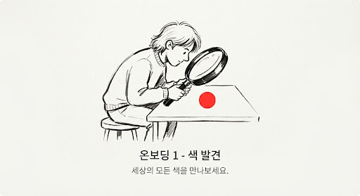
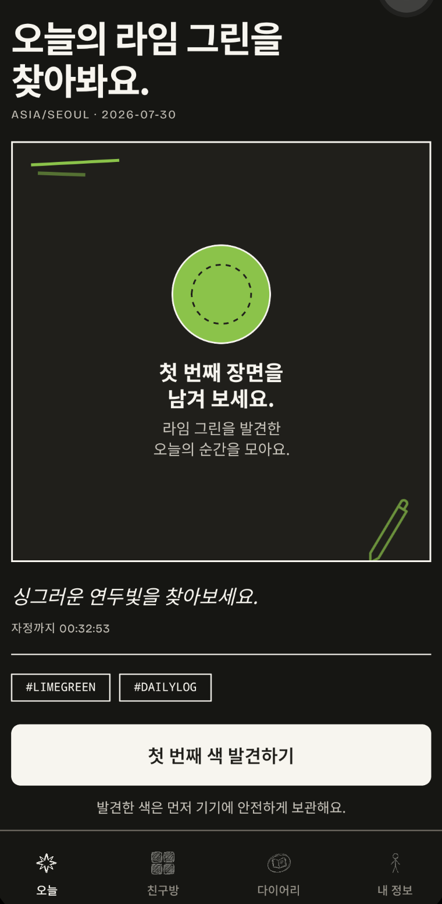
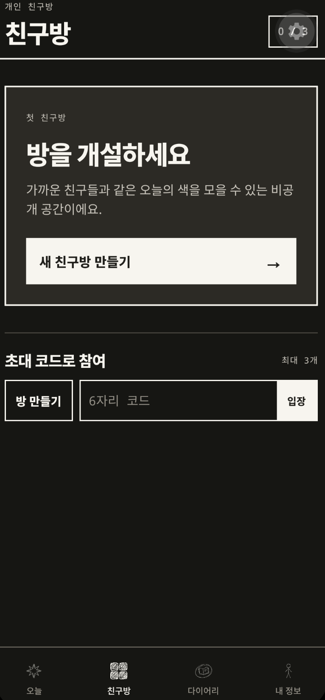
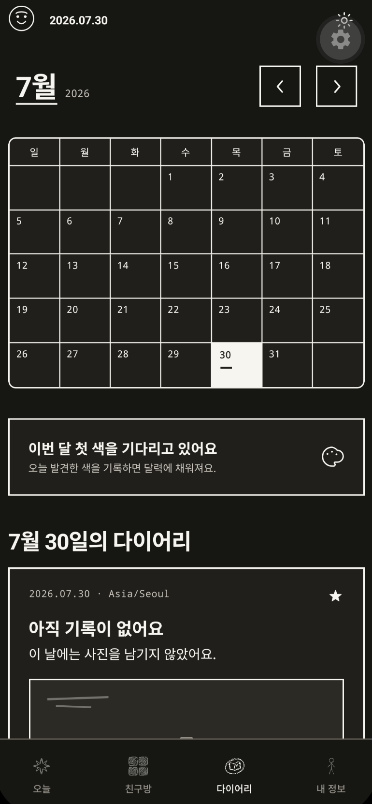
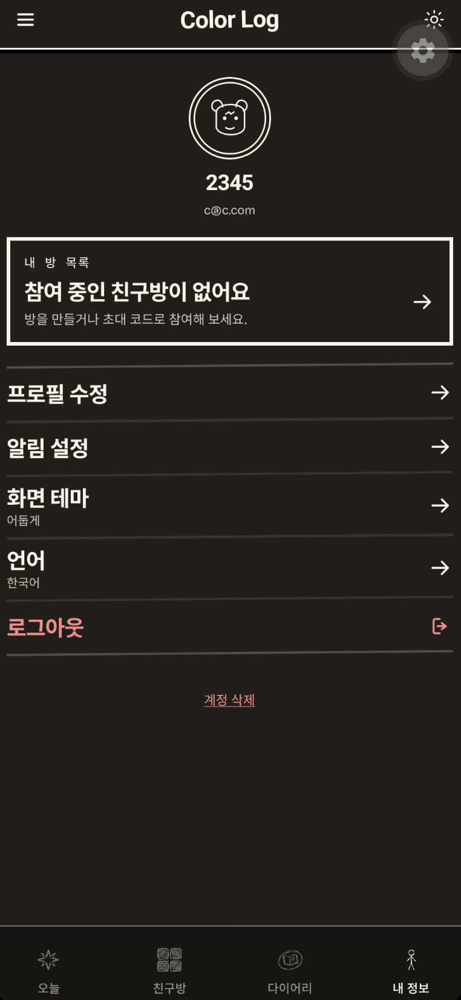

# Color Log

> 오늘의 색으로, 오늘을 남겨요.

<p align="center">
  
</p>

## 오늘, 어떤 색을 발견했나요?

Color Log는 매일 하나의 색을 따라 하루를 기록하는 사진 다이어리예요.

창가에 내려앉은 파랑, 퇴근길 하늘의 주황, 자주 가는 카페 컵의 초록. 스쳐 지나갈 뻔한 장면을 한 장씩 담으면, 오늘이 조금 더 또렷하게 남아요.

글을 길게 쓰지 않아도 괜찮아요. 사진 한 장만으로도 충분히 당신의 하루예요.

## Color Log를 미리 만나보세요

<table>
  <tr>
    <td width="50%" align="center" valign="top">
      
      <br /><br />
      <b>오늘의 색으로 시작하는 하루</b>
      <br />
      <sub>매일 찾아오는 컬러 미션이, 평범한 풍경을 한 번 더 바라보게 해요.</sub>
    </td>
    <td width="50%" align="center" valign="top">
      
      <br /><br />
      <b>가까운 사람과 같은 색을 발견해요</b>
      <br />
      <sub>초대한 사람들만 있는 작은 친구방에서 서로 다른 하루를 나눠요.</sub>
    </td>
  </tr>
  <tr>
    <td width="50%" align="center" valign="top">
      <br />
      
      <br /><br />
      <b>색으로 채워지는 나만의 달력</b>
      <br />
      <sub>하루하루 발견한 장면이 시간이 지나도 꺼내 볼 수 있는 다이어리가 돼요.</sub>
    </td>
    <td width="50%" align="center" valign="top">
      <br />
      
      <br /><br />
      <b>내 방식대로, 편안하게</b>
      <br />
      <sub>프로필과 알림, 언어, 화면 테마를 내 취향에 맞춰 조절할 수 있어요.</sub>
    </td>
  </tr>
</table>

## 매일, 새로운 색 하나

오늘의 컬러 룰렛이 하루의 작은 질문을 건네네요.

“오늘은 이 색을 어디에서 만날 수 있을까?”

정답을 찾는 게임이 아니라, 평소에는 지나쳤을 풍경을 한 번 더 바라보는 시간이에요. 하루가 바뀌면 새로운 색이 찾아오고, 지난 색들은 나만의 다이어리에 차곡차곡 쌓여요.

## 발견한 순간을 가볍게 담아요

카메라를 열고, 마음에 남은 장면을 찍어 보세요.

- 하루에 최대 9장까지 기록할 수 있어요.
- 한 장만 남겨도 오늘의 기록은 완성돼요.
- 짧은 메모를 더하거나, 사진 순서를 바꾸고, 마음이 바뀌면 지울 수도 있어요.
- 6장과 9장을 채우면 오늘의 색이 조금 더 풍성해져요.

바쁜 날에는 한 장, 오래 기억하고 싶은 날에는 아홉 장. 기록의 양은 당신의 하루에 맞추면 돼요.

## 혼자여도 충분하고, 함께하면 더 다정해요

Color Log는 친구가 없어도 완전한 개인 다이어리예요. 매일의 색과 내 사진은 오롯이 나를 위해 남아요.

누군가와 함께하고 싶은 날에는 작은 친구방을 만들 수 있어요. 연인, 가족, 가까운 친구와 같은 오늘의 색을 발견해 보세요. 같은 색을 따라갔지만 서로 전혀 다른 하루가 모이는 순간을 만날 수 있어요.

- 초대한 사람끼리만 들어오는 비공개 친구방
- 2명부터 6명까지, 부담 없이 함께하는 작은 공간
- 오늘의 사진과 지난 기록을 멤버별로 둘러보기
- 방은 여러 개를 만들어 관계마다 다르게 사용하기

## 내 기록은 언제나 나에게

친구와 사진을 함께 보더라도, 원본은 언제나 내 다이어리에 남아요.

Color Log는 친구방에 내 사진을 복사해 두지 않아요. 내가 공유하기로 한 기록만 연결해 보여 주고, 방을 나가도 내 사진과 나의 하루는 사라지지 않아요.

공개 피드도, 낯선 사람의 반응도, 순위를 매기는 경쟁도 없어요. Color Log는 가까운 사람들과 조용히 하루를 나누는 공간이에요.

## 이런 날을 위해 만들었어요

| 이런 순간 | Color Log와 함께라면 |
| --- | --- |
| 긴 글은 부담스럽지만 오늘을 남기고 싶은 날 | 사진 한 장으로 가볍게 기록해요. |
| 매일 무엇을 찍을지 작은 계기가 필요한 날 | 오늘의 색이 관찰의 시작이 되어 줘요. |
| 멀리 있는 친구와 같은 하루를 보내고 싶은 날 | 같은 색으로 서로 다른 하루를 발견해요. |
| 공개 SNS가 피곤한 날 | 초대한 사람들만 있는 작은 방에서 나눠요. |

## Color Log와 함께하는 하루

```text
오늘의 색을 만나요
        ↓
일상에서 그 색을 발견해요
        ↓
사진으로 오늘을 남겨요
        ↓
혼자 다시 꺼내 보거나, 가까운 사람과 나눠요
        ↓
색으로 채워진 나만의 달력을 만들어요
```

## 천천히 쌓이는, 나만의 색

어제의 사진을 다시 볼 때 우리는 그날의 공기와 기분을 떠올리곤 해요. Color Log는 특별한 날만 기록하는 다이어리가 아니라, 평범한 하루가 조금 더 아까워지는 습관을 만들고 싶어요.

오늘의 색을 찾아보세요.
생각보다 많은 순간이, 이미 당신 곁에 있었을 거예요.
